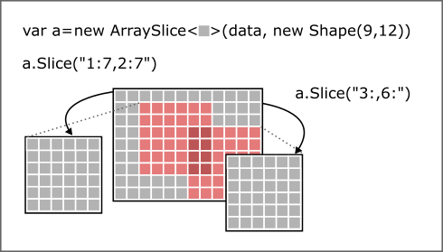

# ArraySlice&lt;T&gt;

<code>ArraySlice&lt;T&gt;</code> is a lightweight wrapper around indexable data structures like <code>T[]</code> for creating arbitrary N-dimimensional views of the data as well as views of (sparse) sub-sections of ArraySlices without copying the underlying data.

## Use Cases
### Working with sub-sections of an array efficiently
Similar to <code>ArraySegment&lt;T&gt;</code>, <code>Span&lt;T&gt;</code> or <code>Memory&lt;T&gt;</code>, you can create views of array sections with <code>ArraySlice&lt;T&gt;</code>. But it can do a lot more than the other solutions: 
* Stepping: slicing every Nth element
* Reshaping: presenting the data as arbitrary N-dimensional shapes
* Nesting: slices can be further sliced

### Multiple views of the same data



Being able to pass only local portions of the underlying data (i.e. small patches of a big image) in and out of algorithms without copying is essential for runtime-performance, especially with big data sets. There exist other solutions to this problem like <code>ArraySegment&lt;T&gt;</code> or the new <code>Span&lt;T&gt;</code> and <code>Memory&lt;T&gt;</code> of .net Core but they lack the ability to step, that is skip data with a fixed stride (see below), or have other limitations, like being only 1-dimensional. If you don't need stepping or multiple dimensions, you might prefer those for their slightly better indexing performance.

### Nested views


The end-result of the chained slicing operations <code>.Slice("2:8,::2").Slice("1::3").Slice(":,2:")</code> could also be obtained by a single operation like this: <code>.Slice("3:8:3,2::2")</code>. <code>ArraySlice&lt;T&gt;</code> optimizes this internally so you don't have to pollute your algorithms with knowledge about the structure of the data. 

### Working with high-dimensional data efficiently


If you need to treat a data array as a volume and work with parts of it without having to do mind-boggling coordinate transformation calculations then <code>ArraySlice&lt;T&gt;</code> is for you.

All <code>ArraySlices</code> created by <code>Reshape</code> or <code>Slice</code> operations are only views of the original data. When you iterate over, read or write elements of a view you access the original data array. <code>ArraySlice&lt;T&gt;</code> transparently does the appropriate index transformations so you can index into the slice using relative coordinates.

### Efficiently reverse the order of the elements

```csharp
var a = new ArraySlice<char>("Stanley Yelnats".ToCharArray());
// reverse the char[] without enumeration or copying! 
Assert.AreEqual("stanleY yelnatS", string.Join("", a.GetSlice("::-1")));
```

Slicing with a negative step is effectively reversing the slice's order. What's nice about that is, that it requires no copying or enumeration of the data to complete this operation much like <code>IEnumerable<T>.Reverse()</code>. The difference is that, the view (which is the result of the operation <code> a.GetSlice("::-1")</code>) presents the data in reversed order and you can index into that reversed sequence without ever having to enumerate it at all. Also, due to the fact that <code>IEnumerators</code> can only be enumerated once, they usually are not suitable for being passed in and out of functions.

## Motivation

<code>ArraySlice&lt;T&gt;</code> is inspired by the array data structure of the popular Python library [NumPy](https://www.numpy.org/) which always creates a view of the original array, no matter what operation is applied to it. <code>ArraySlice&lt;T&gt;</code> implements the same slicing syntax as NumPy and always creates a view of the original data, even if you for instance slice out 1D rows of 2D planes that were sliced out of a 3D volume. In contrast to NumPy, however, <code>ArraySlice&lt;T&gt;</code> does not offer any numerical computation functions. It merely focuses on the view and slicing mechanics in order to remain small and light-weight. 

By the way, the view mechanics and the slicing algorithm of <code>ArraySlice&lt;T&gt;</code> are one of my main contributions to [NumSharp](https://github.com/SciSharp/NumSharp) which is a C# port of NumPy.

## ArraySlice&lt;T&gt; Usage
### Creating an ArraySlice 

An ArraySlice can be created over any .NET data structure, that supports indexing and which length is known. Currently only <code>T[]</code> and <code>List&lt;T&gt;</code> are supported, but support for more types will be added as required. 

```csharp
// create a 1D Array of strings from a List<string>. 
// Note: the List should not be changed after wrapping it inside ArraySlice
var b = new ArraySlice<string>( new List<string> {"Aardvark", "Ant", "Bear", ... });
```

By default, a 1D ArraySlice is created. If you specify a <code>Shape</code> the underlying data will be represented as an N-dimensional matrix or volume.

```csharp
// create a 3D volume of bytes from a byte[]
var a = new ArraySlice<byte>( new byte[72], new Shape(3,4,6));
```

### Shape

The <code>Shape</code> of an <code>ArraySlice&lt;T&gt;</code> describes how many dimensions it has and what the extent of these dimensions is:

```csharp
new Shape(100)      // a 1D array of length 100
new Shape(3,5)      // a 2D matrix with 3 rows and 5 columns
new Shape(2,3,5)    // a 3D volume of 2 matrices with 3 rows and 5 columns
new Shape(2,3,5,7, ... N) // an N-dimensional volume
new Shape()         // a scalar (Shape of return values when indexing into 1D array with [Slice.Index(...)]
```

Note: in order to be able to represent data as an N-dimensional volume, the length of the data must be the product of all dimensions of the shape.

### Slice notation
<code>ArraySlice&lt;T&gt;</code> can be sliced using Python slice notation (with the exception that ArraySlice<T> does not copy the underlying array data, like NumPy. 

A slice is constructed either by  **range notation** <code>["start:stop:step"]</code> or by **index notation** <code>["index"]</code>.

Range Notation Examples: 

```csharp
a["5:10"]        // return 5 elements starting at index 5 through index 9
a["5:"]          // return the rest of the array starting at index 5
a[":10"]         // return 10 elements from the beginning through index 9 (same as "0:10")
```

The key point to remember is that the **:stop** value represents the first value that is not 
in the selected slice. So, the difference between stop and start is the number of elements 
selected (if step is 1, the default).

There is also the step value, which can be used with any of the above:

```csharp
a[$"{start}:{stop}:{step}"] // start through not past stop, by step
a[new Slice(start, stop, step)] // same as [$"{start}:{stop}:{step}"]
```

Note the difference between indexing with integers and strings. Indexing with integers will return a scalar value of type <code>T</code>. Indexing with slice notation strings will return an <code>ArraySlice&lt;T&gt;</code>, the same as <code>.Slice()</code> would.

```csharp
a[5]           // returns the element at index 5
a["5"]         // returns a ArraySlice<T> which contains only the element at index 5, Shape is (), which means scalar
a["5:6:1"]     // same as ["5"] except for the Shape which is (1)
```

The other feature is that start or stop may be a negative number, which means it counts 
from the end of the array instead of the beginning. So:

```csharp
a[-1]         // last item in the array
a["-2:"]      // last two items in the array
a[":-2"]      // everything except the last two items
```

Similarly, step may be a negative number:

```csharp
a["::-1"]     // all items in the array, reversed
a["1::-1"]    // the first two items, reversed
a[":-3:-1"]   // the last two items, reversed
a["-3::-1"]   // everything except the last two items, reversed
```

Like *NumPy* <code>ArraySlice&lt;T&gt;</code> is kind to the programmer if there are fewer items than 
you ask for. For example, if you  ask for <code>a[":-2"]</code> and a only contains one element, you get an 
empty list instead of an error. Sometimes you would prefer the error, so you have to be aware 
that this may happen.

### Slicing 2-dimensional arrays

The above summary of the slicing notation showed only 1D examples. <code>ArraySlice&lt;T&gt;</code> can represent and slice 2D, 3D or ND shaped data by allowing a slice definition per dimension separated by comma.

```csharp
a[":"]           // return everything (but without copying)
a["5, :"]        // return the whole 5th row of a 2D matrix (index notation, range notation)
a[Slice.Index(5), Slice.All()]   // same as ["5, :"]
a["5, :100"]     // return the first 100 elements of the 5th row
```

Note that <code>ArraySlice&lt;T&gt;</code> represents 2D matrices in **row major** style, meaning that you address an element in a 2D array like this: <code>a[row, column]</code>. By this definition you can access a column by indexing the rows with ":" (= range over all rows) like this:

```csharp
a[":, 5"]        // return the whole 5th column of a 2D matrix
a[Slice.All(), Slice.Index(5)]   // same as [":, 5"]
a[":100, 5"]     // return the first 100 elements of the 5th column
```

### Slicing N-dimensional arrays

When slicing an N-dimensional slice of an N-dimensional ArraySlice you can specify N slicing definitions to define how the volume is or is not reduced in every dimension. Consider the following example where we cut a smaller cube out of a cube.

```csharp
var cube=ArraySlice<int>.Range(27).Reshape(3,3,3);
// slicing a 2x2x2 cube out of a 3x3x3 cube by skipping the first element of each dimension
var cube1=cube["1:,1:,1:"];
```

If you specify less slicing definitions than dimensions, the missing dimensions will be returned in whole.

### Reducing dimensions

When you specify an index instead of a range (i.e. <code>["5"]</code> instead of <code>["5:6:1"]</code>) you get a slice of reduced dimensions. Let me explain in more detail:

Let's say you want to get a row or a column out of a 2D matrix as a 1D Vector:
```csharp
var matrix=ArraySlice<int>.Range(25).Reshape(5,5);
// slicing the 2nd row
var row = matrix["1"]; // Note: this is NOT the same as matrix[1] which gives the first element of that row 
// slicing the 2nd colum
var column = matrix[":,1"];
```

The result of both slicing operations is a 1D vector of shape (5), so we have effectively reduced the dimensions from two to one. In comparison, if not using index notation for slicing but range notation we get a 2D matrix with only one column or one row:

```csharp
var matrix=ArraySlice<int>.Range(25).Reshape(5,5);
// slicing the 2nd row with range notation
var row = matrix["1:2"];
// slicing the 2nd colum with range notation
var column = matrix[":,1:2"];
```

As a result of slicing with range notation above sample gives us <code>row</code> as a 2D matrix of shape (1,5) and <code>column</code> as a matrix of shape (5,1).

## Examples


## License

MIT

## Releases

[SliceAndDice.dll](https://www.nuget.org/packages/SliceAndDice/1.0.0) Version 1.0.0 is available as Nuget Package for .Net Standard

