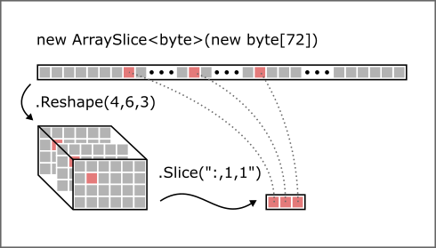
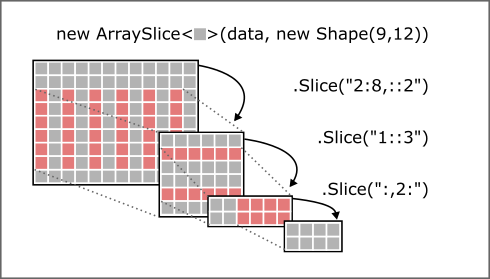

# ArraySlice&lt;T&gt;

<code>ArraySlice&lt;T&gt;</code> is a lightweight wrapper around indexable data structures like <code>T[]</code> for creating arbitrary N-dimimensional views of the data as well as views of (sparse) sub-sections of ArraySlices without copying the underlying data.

## Use Cases

### Working with high-dimensional data efficiently

If you need to treat a data array as a volume and work with parts of it without having to do mind-boggling coordinate transformation calculations then <code>ArraySlice&lt;T&gt;</code> is for you.



All <code>ArraySlices</code> created by <code>Reshape</code> or <code>Slice</code> operations are only views of the original data. When you iterate over, read or write elements of a view you access the original data array. <code>ArraySlice&lt;T&gt;</code> transparently does the appropriate index transformations so you can index into the slice using relative coordinates.

### Multiple views of the same data


### Nested views



The end-result of the chained slicing operations <code>.Slice("2:8,::2").Slice("1::3").Slice(":,2:")</code> could also be obtained by a single operation like this: <code>.Slice("3:8:3,2::2")</code>. <code>ArraySlice&lt;T&gt;</code> optimizes this internally so you don't have to pollute your algorithms with knowledge about the structure of the data. 

## Motivation

<code>ArraySlice&lt;T&gt;</code> is inspired by the array data structure of the popular Python library [NumPy](https://www.numpy.org/) which always creates a view of the original array, no matter what operation is applied to it. <code>ArraySlice&lt;T&gt;</code> implements the same slicing syntax as NumPy and always creates a view of the original data, even if you for instance slice out 1D rows of 2D planes that were sliced out of a 3D volume. In contrast to NumPy, however, <code>ArraySlice&lt;T&gt;</code> does not offer any numerical computation functions. It merely focuses on the view and slicing mechanics in order to remain small and light-weight. 

By the way, the view mechanics and the slicing algorithm of <code>ArraySlice&lt;T&gt;</code> are one of my main contributions to [NumSharp](https://github.com/SciSharp/NumSharp) which is a C# port of NumPy.

### Example: Bitmap Manipulation
Let's say you have no image manipulation library and you want to manipulate the pixels of an image as RGB <code>byte[]</code>:

```csharp
    var width = 4; // px
    var height = 4; // px
    var bytes_per_pixel = 3; // r, g, b

    // note that Slice and Dice uses the row major coordinate system like numpy
    // so the coordinate order is y, x, color in this example
    var shape = new Shape(height, width, bytes_per_pixel);

    // create the raw pixel data using Shape.Size to calculate how long the array 
    // must be to hold a 3D volume of h x w x byte_per_pixel
    var raw_bytes = new byte[shape.Size];
    var image = new ArraySlice<byte>(raw_bytes, shape);

    // we can now access single pixel values by coordinates

    // get the three bytes for the pixel at the upper right corner 
    // as ArraySlice<T> without copying any data!
    var pixel = image.GetSlice("0, 3");
    Console.WriteLine("pixel: " + pixel);  // prints: pixel: [0, 0, 0]

    // set the pixel to white
    image.SetValues(new int[] { 0, 3 }, new byte[] { 255, 255, 255 });

    // get the 2 by 2 pixel patch at the center and color it green without copying any data:
    var patch = image.GetSlice("1:3, 1:3, 1"); // this gets only the green channel 
    // note how we can now use relative coordinates in the patch
    // since this is a slice of the green channel we can directly set the green byte at location (y,x)
    for (int y = 0; y < 2; y++)
	for (int x = 0; x < 2; x++)
	    patch[y, x] = 255; 

    // print the bitmap out row by row like this (black = '#', white = ' ', green= 'o')
    // obviously by using slicing this is a no-brainer
    for (int y = 0; y < height; y++)
    {
	Console.Write("|");
	// Slice.Index gives us a slice-definition for a row at index y. 
	// You could also use image.GetSlice($"{y}")
	var row =image.GetSlice(Slice.Index(y));
	for (int x = 0; x < width; x++)
	{
	    var red = row[x, 0];
	    var green = row[x, 1];
	    if (red == 0 && green==0)
	    {
		// must be black
		Console.Write("#");
		continue;
	    }
	    if (red==255 && green==255)
	    {
		// must be white
		Console.Write(" ");
		continue;
	    }
	    if (green==255)
		Console.Write("o");
	}
	// at the end of the row, break the line
	Console.WriteLine("|");
    }
```

output:

```text
pixel: [0, 0, 0]
|### |
|#oo#|
|#oo#|
|####|
```
